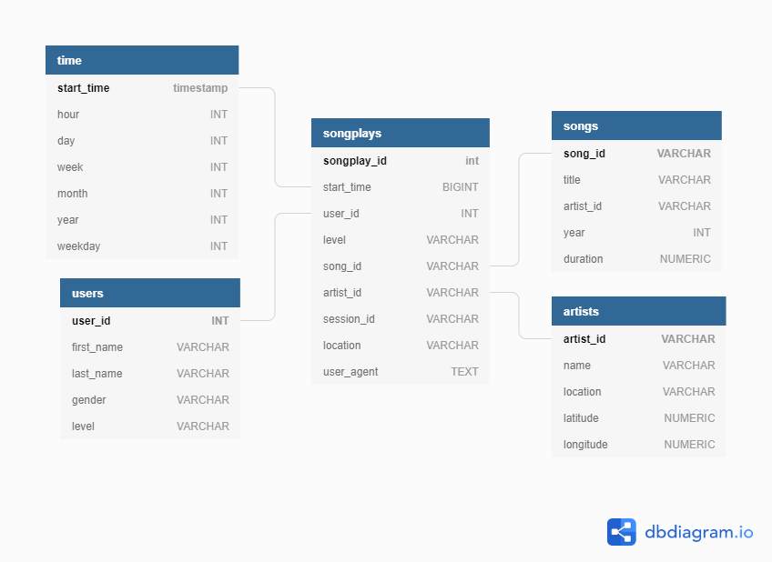

# Project: Data Modeling with Postgres
## Introduction
A startup called Sparkify wants to analyze the data they've been collecting on songs and user activity on their new music streaming app. The analytics team is particularly interested in understanding what songs users are listening to. Currently, they don't have an easy way to query their data, which resides in a directory of JSON logs on user activity on the app, as well as a directory with JSON metadata on the songs in their app.

They'd like a data engineer to create a Postgres database with tables designed to optimize queries on song play analysis, and bring you on the project. Your role is to create a database schema and ETL pipeline for this analysis. You'll be able to test your database and ETL pipeline by running queries given to you by the analytics team from Sparkify and compare your results with their expected results.

## Project Description
In this project, you'll apply what you've learned on data modeling with Postgres and build an ETL pipeline using Python. To complete the project, you will need to define fact and dimension tables for a star schema for a particular analytic focus, and write an ETL pipeline that transfers data from files in two local directories into these tables in Postgres using Python and SQL. 

## Requirements
In order to be able to run this project you need the following software/libraries:
- Python 3 (project built with version 3.6.3)
- Pandas (0.23.3)
- Psycopg2 (2.7.4)
- PostgreSQL

## Running the Project
The following commands need to be run in a terminal (in the given order):
1. python create_tables.py
2. python etl.py

## Database Design
The database follows a star schema model where there is only one main Fact table referring to 4 different Dim tables.

### Fact Table
- Songplays: Stores activity of users

### Dim Tables
- Time: Time related information
- Users: Data about users registered in our app
- Songs: Important data of the song we store
- Artists: Important data of the artist we have

## ETL Process
The extract, transform and load (ETL) process starts when running the etl.py script of the project which executes the following steps:
1. Reads data from two main folders within the "data" folder:
    - log_data: JSON files containing activity logs of the users of our music stream app 
    - song_data: JSON files containing data related to the songs and artists our clients listen to
2. Loads records to the songs and artists dim tables
3. Loads records to the users and time dim tables
4. Loads data to the songplays fact table

## Description of Files
### data/log_data
Directory containing JSON files with logs of user activity
### data/song_data
Directory containing JSON files with data about the music and artists listened by our clients
### create_tables.py
Python script that drops and creates PostgreSQL tables
### etl.ipynb
Jupyter notebook used for exploring data and preparing functions to load data into tables
### etl.py
Python script that reads all files from data directory to load their records into our dim and fact tables
### sql_queries.py
Python script containing all required SQL queries to execute our ETL process
### test.ipynb
Jupyter notebook just for testing (executing queries against DB) to check results from ETL process
